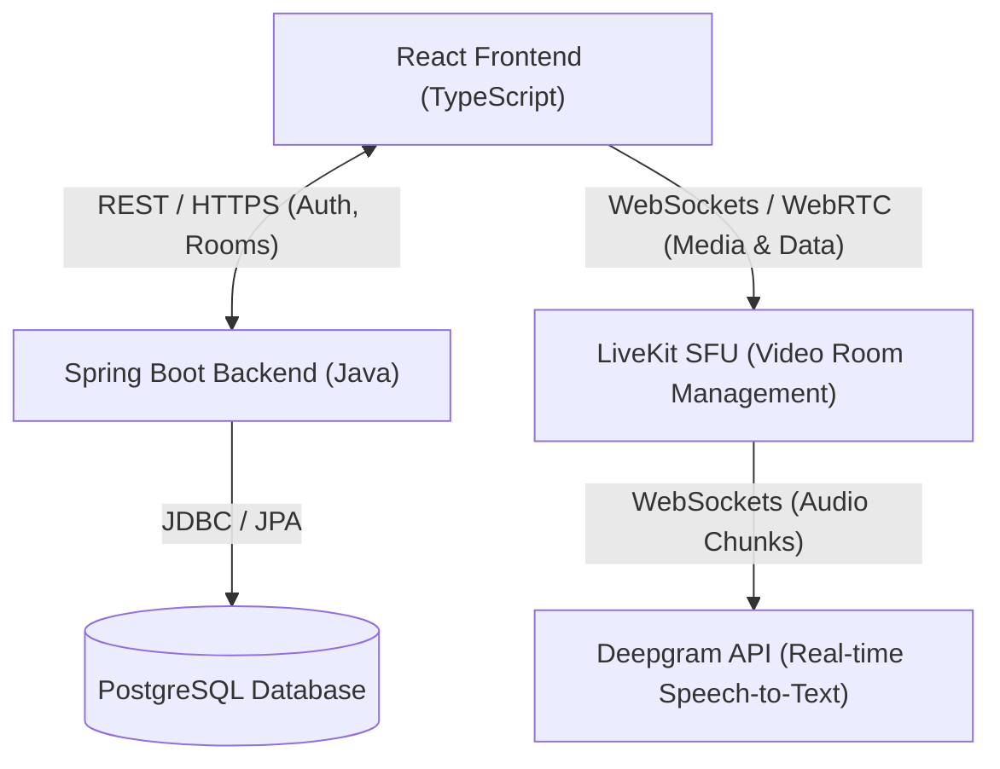
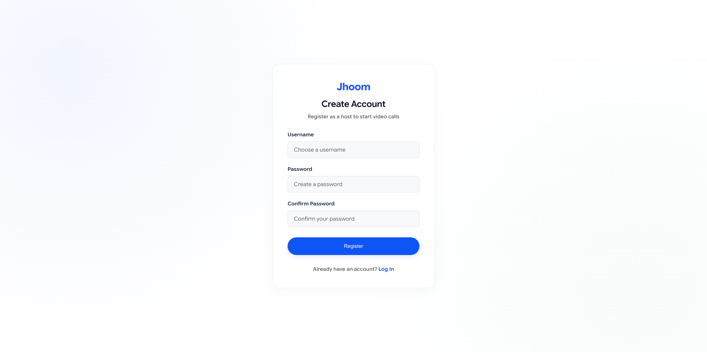
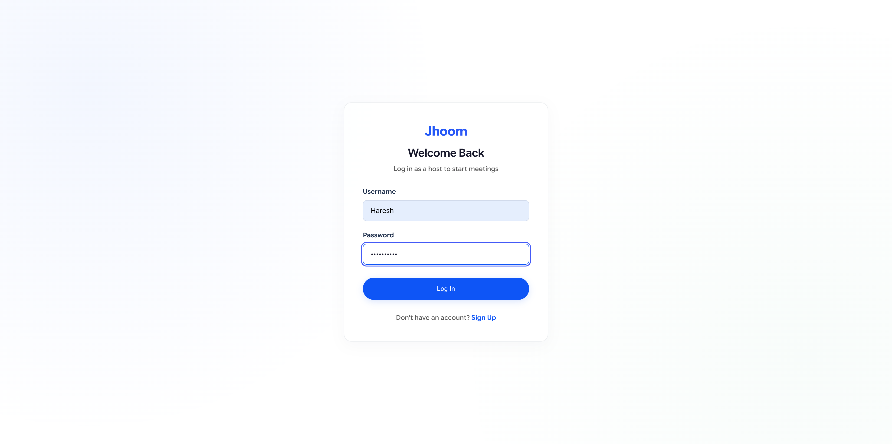
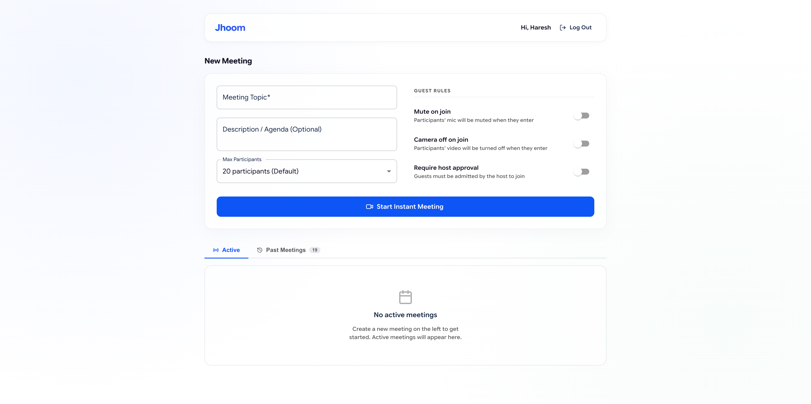
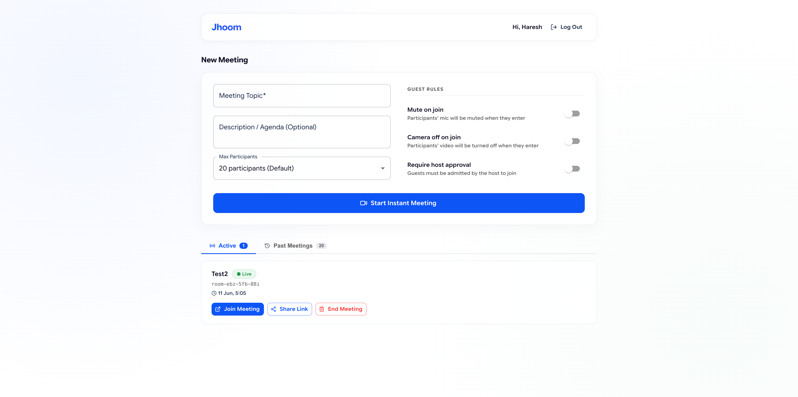
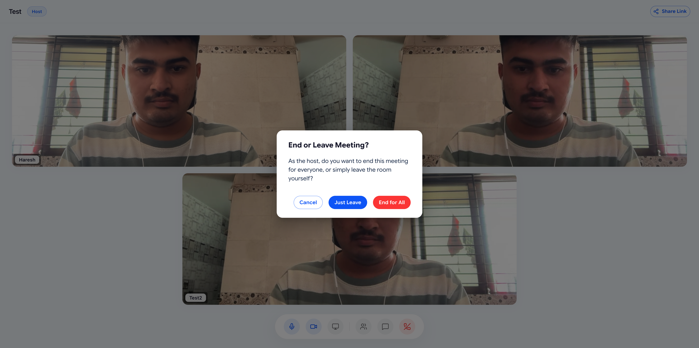
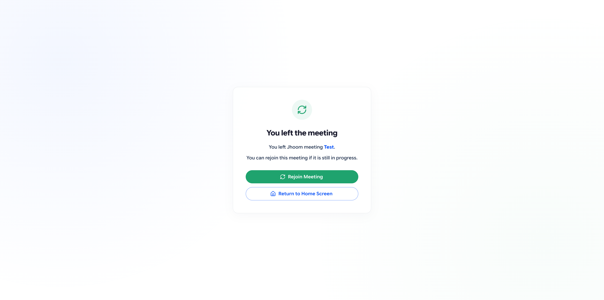
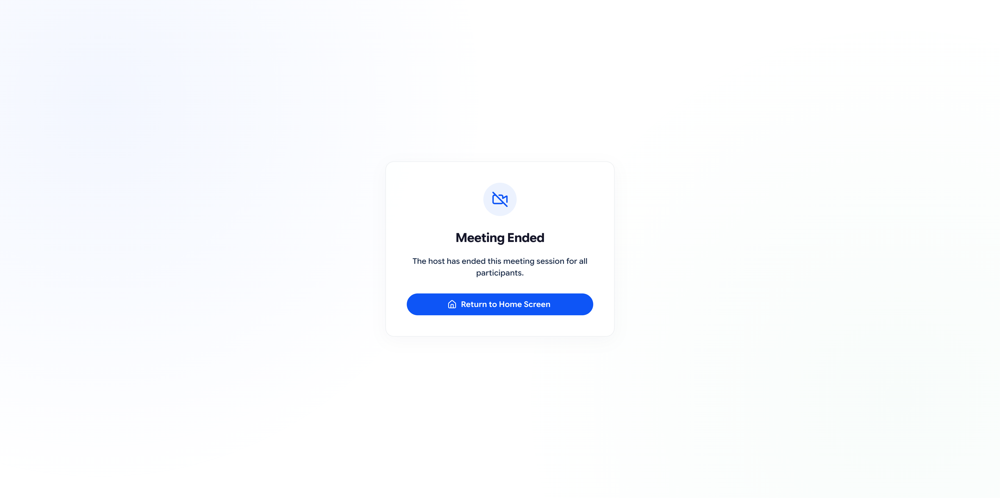

# Next-Gen Video Collaboration Platform

A production-grade, spec-driven WebRTC video conferencing platform featuring secure host authentication, instant guest access, and real-time AI-powered speech-to-text transcription with speaker diarization.



---

## 1. Submission Metadata & Scoping

| Metric | Details / Actuals |
| :--- | :--- |
| **Public GitHub Repository** | [https://github.com/haresssh/Jhoom](https://github.com/haresssh/Jhoom) |
| **Estimated Scoping Timeframe** | 16–20 Hours (Determined during specs scoping) |
| **Actual Time Spent** | ~14 Hours (Scaffolding, WebRTC grid, LiveKit integration, Deepgram stream piping, local network/mobile optimizations, profiles refactoring) |

---

## 2. Core Features Implemented

* **Secure Host Portal:** Hosts can sign up and log in securely (BCrypt passwords, stateless JWT session tokens). Only hosts can initiate meetings.
* **Instant Guest Joining:** Guests can instantly join calls via a shared link simply by inputting their display name—no accounts or logins required.
* **Premium Responsive Video Grid:** A minimal, dark-themed glassmorphic UI built using `@livekit/components-react` that dynamically adjusts tiles dynamically as participants join/leave.
* **One-Click Share:** Share meeting links instantly using the integrated clipboard-copy button with visual alerts.
* **Live AI Transcription Sidebar:** A toggleable sidebar streaming transcripts word-by-word with ultra-low latency.
* **Speaker Diarization & Attribution (★ Bonus Component):** Deepgram's streaming engine automatically separates voices and tags spoken words, which are broadcasted using LiveKit WebRTC Data Channels to display real-time speaker labels (e.g. `John Doe (Speaker 0)`).
* **Mute Protection:** Audio packet streaming to Deepgram is paused automatically when muted in LiveKit, keeping the connection alive using 10s KeepAlive pings.

---

## 3. User Interface Gallery

### **Host Authentication**
* **Create Account / Signup:**
  
* **Log In / Welcome Back:**
  

### **Host Dashboard & Room Configuration**
* **Room Scheduler & Options Panel:** Set meeting topic, agenda description, maximum participant counts, and default guest audio/video/approval policies.
  
* **Active Room Administration:** Manage ongoing meetings, copy direct URLs, or terminate active calls.
  

### **Meeting Room Session**
* **Responsive Video Grid & Controls:** Dynamic WebRTC participant tiles with integrated participants list, active host administration controllers (remote mute, kick/remove), and real-time transcription panel with speaker attribution and download logs.
  
* **Screen Sharing Interface:** Share your screen or application window natively to all participants inside the dynamic grid layout.
  
* **Leave/End Session Controls:** Clear host options to end the call for everyone or exit the room individually.
  

### **Post-Meeting Navigation**
* **Guest Leave / Rejoin Screen:**
  
* **Host Ended Notification:**
  

---

## 4. Local Development Guide

### **A. Database Setup**
Spin up the PostgreSQL database container in the root directory:
```bash
docker-compose up -d
```
*Creates a Postgres instance running on localhost:5432 with db: `videocollab`.*

### **B. Backend Server Setup**
1. Copy your keys into `backend/src/main/resources/application-local.yml` (this file is ignored by Git):
   ```yaml
   app:
     livekit:
       url: wss://your-livekit-url.livekit.cloud
       api-key: your-livekit-key
       api-secret: your-livekit-secret
     deepgram:
       api-key: your-deepgram-api-key
   ```
2. Run the Spring Boot server (binds on port `8080`):
   ```bash
   cd backend
   mvn spring-boot:run
   ```

### **C. Frontend Server Setup**
1. Install dependencies and start the Vite dev server (binds on port `5173`):
   ```bash
   cd frontend
   npm install
   npm run dev
   ```
2. Access the application at `http://localhost:5173`.

---

## 5. Local Network & Mobile Device Testing

Mobile browsers disable media permissions (`getUserMedia`) on insecure `http` connections unless accessed via `localhost`.

### **Option 1: Mobile Tunneling (Recommended for iOS/Android)**
To test on a mobile phone easily over HTTPS without any certificate setups:
1. Run a secure localtunnel in a new terminal:
   ```bash
   npx localtunnel --port 5173
   ```
2. Visit the generated `https://` URL on your phone's browser! 

### **Option 2: USB Port Forwarding (Best for Android Chrome)**
1. Connect your phone via USB with **USB Debugging** enabled.
2. In Mac Chrome, navigate to `chrome://inspect/#devices`, click **Port Forwarding...**, and forward `5173` to `localhost:5173` and `8080` to `localhost:8080`.
3. Open `http://localhost:5173` on your mobile Chrome browser.

---

## 6. AWS Production Deployment Guide

We deploy the platform as a containerized unified application to **Amazon ECS Express Mode** (AWS Fargate) connected to a managed **Amazon RDS PostgreSQL** database:

1. **Build the Docker Container:**
   Packages both the Vite/React static assets and the Spring Boot fat JAR into a single Temurin JRE container:
   ```bash
   docker build --platform linux/amd64 -t jhoom-app .
   ```
2. **Push to ECR & Launch ECS Express Service:**
   The image is pushed to Amazon ECR, and the container tasks are launched using ECS Express Mode, which automatically provisions the load balancer, TLS/HTTPS security layers, and ingress gateways.

For complete, step-by-step AWS CLI setup, configuration parameters, and cleanup commands, please refer to the [deployment_runbook.md](file:///Users/hareshprajapati/dev/video-collaboration-platform/deployment_runbook.md) located in the root directory.
