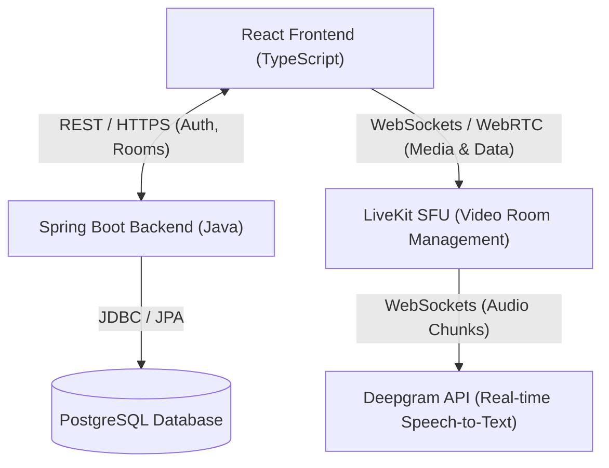
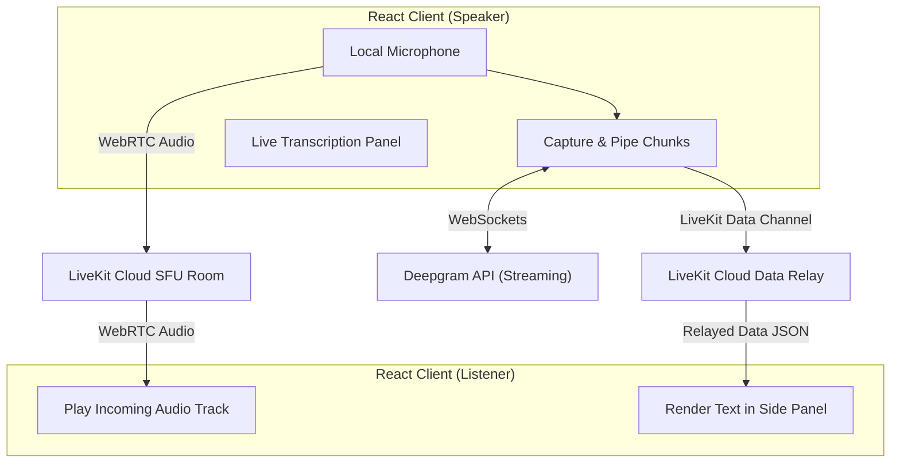

# Technical Specification: Next-Gen Video Collaboration Platform

This document outlines the architecture, database design, API contracts, real-time audio/video pipelines, and deployment strategy for the Video Collaboration Platform.

---

## 1. System Architecture

The platform uses a decoupled client-server architecture with third-party integrations for WebRTC (video/audio) and real-time AI transcription:



### Stack Components:
* **Frontend:** React (TypeScript) + Vite + CSS Modules.
* **Backend:** Spring Boot (Java 17+) + Spring Data JPA + Spring Security (stateless JWT).
* **Database:** PostgreSQL.
* **Video/Audio Infrastructure:** LiveKit Cloud (WebRTC).
* **Transcription Service:** Deepgram (Real-time WebSocket Streaming).
* **Deployment:** Amazon RDS (PostgreSQL) + Amazon ECS Express Mode (AWS Fargate).

---

## 2. Database Schema (PostgreSQL)

The database stores user profiles, authentication credentials, and meeting session logs.

```sql
-- User account storage for Host authentication
CREATE TABLE users (
    id BIGSERIAL PRIMARY KEY,
    username VARCHAR(50) UNIQUE NOT NULL,
    password_hash VARCHAR(255) NOT NULL,
    created_at TIMESTAMP WITH TIME ZONE DEFAULT CURRENT_TIMESTAMP
);

-- Historical meeting room logs
CREATE TABLE rooms (
    id VARCHAR(100) PRIMARY KEY, -- Room ID (UUID or random alphanumeric string)
    name VARCHAR(100) NOT NULL,
    host_id BIGINT REFERENCES users(id) ON DELETE CASCADE,
    is_active BOOLEAN DEFAULT TRUE,
    created_at TIMESTAMP WITH TIME ZONE DEFAULT CURRENT_TIMESTAMP,
    ended_at TIMESTAMP WITH TIME ZONE
);
```

---

## 3. API Contract

All REST endpoints use standard JSON payloads. Protected endpoints require a `Authorization: Bearer <JWT>` header.

### 3.1. Authentication
* **`POST /api/auth/register`** (Public)
  * Request Body:
    ```json
    {
      "username": "host_user",
      "password": "securepassword123"
    }
    ```
  * Response (201 Created):
    ```json
    {
      "message": "User registered successfully",
      "username": "host_user"
    }
    ```

* **`POST /api/auth/login`** (Public)
  * Request Body:
     ```json
     {
       "username": "host_user",
       "password": "securepassword123"
     }
     ```
  * Response (200 OK):
     ```json
     {
       "token": "eyJhbGciOiJIUzI1NiIsIn...",
       "username": "host_user"
     }
     ```

### 3.2. Room Management
* **`POST /api/rooms`** (Protected - Host Only)
  * Request Body:
     ```json
     {
       "roomName": "Weekly Sync"
     }
     ```
  * Response (201 Created):
     ```json
     {
       "roomId": "room-abc-123",
       "roomName": "Weekly Sync",
       "hostToken": "livekit_host_token_string..."
     }
     ```

* **`POST /api/rooms/{roomId}/join`** (Public - Guest / Host Join)
  * Request Body:
     ```json
     {
       "displayName": "Guest User"
     }
     ```
  * Response (200 OK):
     ```json
     {
       "roomId": "room-abc-123",
       "token": "livekit_participant_token_string...",
       "livekitUrl": "wss://your-livekit-url.com"
     }
     ```

### 3.3. Transcription Token
* **`GET /api/transcription/token`** (Protected - Authenticated Room Participants)
  * Returns a short-lived ephemeral Deepgram token to prevent master key exposure in the frontend.
  * Response (200 OK):
     ```json
     {
       "token": "ephemeral_deepgram_api_key_here...",
       "expiresAt": "2026-06-08T18:30:00Z"
     }
     ```

---

## 4. Real-time Audio, Video, & Data Flow

To avoid costly server-side mixing, WebRTC media and transcription text stream directly through the client-side mesh using LiveKit and Deepgram.



### 4.1. LiveKit Video Grid Flow
1. **Connection:** The React client initializes a LiveKit `Room` object and connects to the LiveKit server using the token obtained from the Spring Boot API.
2. **Publishing:** The host/guest client publishes local audio and video tracks to the room.
3. **Subscribing:** Every client automatically subscribes to all incoming video and audio tracks. The UI renders participant tiles in a flexible CSS flexbox/grid layout that recalculates geometry based on the count of active participants.

### 4.2. Transcription & Diarization Pipeline
1. **Audio Capturing:** The speaker's client uses the HTML5 `MediaRecorder` API to capture the audio input stream at a sample rate of 16kHz.
2. **Deepgram Connection:** The client opens a secure WebSocket connection to Deepgram's streaming service:
   `wss://api.deepgram.com/v1/listen?encoding=linear16&sample_rate=16000&diarize=true&interim_results=true&endpointing=300`
3. **Audio Streaming:** As audio packets are recorded (every 250ms), they are sent as binary buffers over the WebSocket.
4. **Processing & Speaker Diarization:** Deepgram processes the stream in real-time. If multiple voices speak into the same mic, Deepgram tags each word with a speaker index (e.g., `speaker: 0`, `speaker: 1`).
5. **Relay via Data Channel:** When the speaker's client receives a transcript payload from Deepgram, it bundles the transcription into a JSON object:
   ```json
   {
     "senderName": "John Doe",
     "text": "Hello, how are you?",
     "isFinal": true,
     "speakerTag": 0
   }
   ```
   The client broadcasts this payload to all other participants using **LiveKit Data Channels** (`room.localParticipant.publishData`) with reliable delivery mode.
6. **Side Panel UI Rendering:** All clients listen for the `dataReceived` event from LiveKit, parse the JSON payload, and append the transcript text directly to the scrollable side panel.

---

## 5. Security & Isolation

1. **API Key Security:** The master `DEEPGRAM_API_KEY` and `LIVEKIT_API_SECRET` are kept strictly on the backend. The backend issues short-lived ephemeral credentials for clients.
2. **Stateless JWTs:** Access control is verified cryptographically using signature checking.
3. **Database Privacy:** Connection credentials, DB passwords, and signing keys are loaded strictly from environment variables (`.env` or standard system environments) and never committed to version control.
4. **Anonymity Compliance:** No corporate branding or specific company names appear anywhere in the codebase, SPEC, or endpoints.

---

## 6. AWS Deployment Plan

For production and staging deployments, the application is packaged as a unified Docker container and deployed using **Amazon ECS Express Mode** (AWS Fargate) connected to a managed **Amazon RDS PostgreSQL** database:

* **Database:** **Amazon RDS (PostgreSQL)** configured on a `db.t3.micro` instance. Inbound security rules permit access on port `5432` from ECS tasks.
* **Ingress & TLS/HTTPS:** ECS Express Mode automatically provisions the Application Load Balancer (ALB), listener target groups, and exposes a secure HTTPS ingress gateway endpoint (`https://*.on.aws`), enabling microphone and camera capture permissions on client web browsers.
* **Unified Container Service:** 
  * The application uses a multi-stage Dockerfile that builds the React static assets, bundles them into the Spring Boot JAR, and packages them in a lightweight runtime container.
  * Container images are pushed to a private **Amazon ECR** repository.
  * ECS Express Mode deploys and orchestrates the tasks dynamically on AWS Fargate serverless infrastructure.
* **Benefits:** Out-of-the-box HTTPS/TLS certificates, zero CORS configuration conflicts, automated infrastructure provisioning, and serverless compute scaling.

To redeploy or tear down the stack, refer to the detailed [deployment_runbook.md](file:///Users/hareshprajapati/dev/video-collaboration-platform/deployment_runbook.md) in the repository root.
